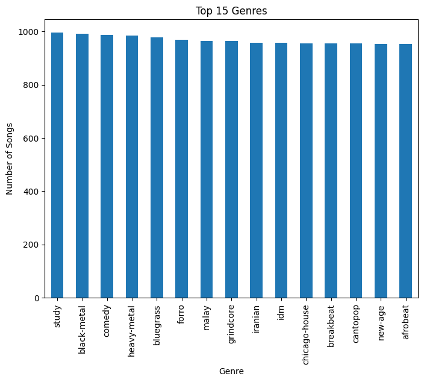
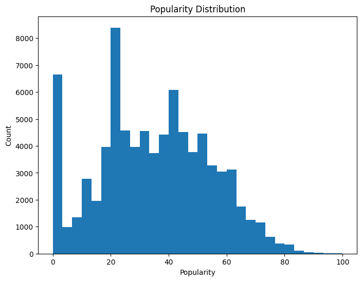
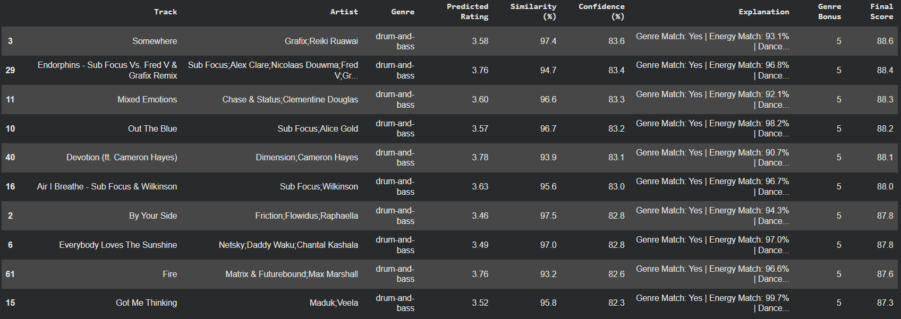

# 🎵 Hybrid Explainable Spotify Music Recommendation System

A hybrid music recommendation system that combines **Content-Based Filtering using KNN** and **Collaborative Filtering using SVD** to generate personalized music recommendations. An **Explainable AI (XAI)** module provides similarity scores, confidence scores, and feature-based explanations for each recommendation.

---

## 📌 Project Overview

Music streaming platforms provide access to millions of songs, making it difficult for users to discover music that matches their preferences.

This project addresses this problem by combining two recommendation approaches:

- **Content-Based Filtering** – recommends songs based on similar audio characteristics.
- **Collaborative Filtering** – predicts user preferences based on listening interactions.
- **Hybrid Recommendation** – combines both approaches to improve personalization.
- **Explainable AI** – provides understandable reasons behind each recommendation.

The system is developed using Spotify song metadata and audio features and is implemented in Python using machine learning techniques.

---

## 🎯 Objectives

- Generate personalized music recommendations.
- Identify songs with similar musical characteristics.
- Learn user preferences from listening interactions.
- Combine content-based and collaborative filtering.
- Provide transparent explanations for recommendations.
- Support discovery of both popular and lesser-known songs.

---

## 🛠️ Technologies Used

- **Python**
- **Pandas**
- **NumPy**
- **Scikit-learn**
- **Surprise**
- **Matplotlib**
- **Seaborn**
- **Google Colab**
- **Machine Learning**
- **Explainable AI (XAI)**

---

## 📊 Dataset

The project uses a Spotify songs dataset containing approximately **114,000 tracks** with audio features and metadata.

### Key Features

| Feature | Description |
|---|---|
| Danceability | Measures how suitable a track is for dancing |
| Energy | Represents the intensity and activity of a track |
| Tempo | Speed of the track measured in BPM |
| Loudness | Overall loudness of the track |
| Acousticness | Probability that the track is acoustic |
| Speechiness | Presence of spoken words in the track |
| Instrumentalness | Likelihood that the track contains no vocals |
| Liveness | Detects the presence of a live audience |
| Valence | Represents the musical positivity or mood |
| Popularity | Popularity score of the track |
| Genre | Musical genre of the track |
| Artist | Artist performing the track |

---

## 🔍 Exploratory Data Analysis

Exploratory Data Analysis was performed to understand the dataset and identify useful patterns before model development.

### 1. Genre Distribution

The dataset contains a relatively balanced distribution of songs across genres, reducing genre bias and allowing the model to learn diverse musical patterns.

### 2. Correlation Analysis

The correlation heatmap revealed relationships between audio features such as **energy, loudness, and acousticness**. These relationships helped identify informative features for content-based recommendation.

### 3. Popularity Distribution

The dataset contains both popular and lesser-known songs, supporting diverse recommendations and helping the system promote music beyond highly popular tracks.

---

## 🧹 Data Preprocessing

The following preprocessing steps were performed:

- Handling missing values.
- Selecting relevant audio features.
- Removing unnecessary attributes.
- Standardizing numerical features using `StandardScaler`.
- Preparing user-song interaction data for collaborative filtering.
- Removing duplicate or irrelevant records where required.

These steps ensure that the data is suitable for both content-based and collaborative filtering models.

---

## 🤖 Recommendation Methodology

The proposed system consists of three major recommendation components.

### 1. Content-Based Filtering — KNN

The **K-Nearest Neighbors (KNN)** algorithm with **cosine distance** is used to identify songs with similar audio characteristics.

The following features are used:

- Danceability
- Energy
- Key
- Loudness
- Mode
- Speechiness
- Acousticness
- Instrumentalness
- Liveness
- Valence
- Tempo
- Popularity

The features are standardized before applying KNN to ensure that differences in feature scales do not affect similarity calculations.

---

### 2. Collaborative Filtering — SVD

**Singular Value Decomposition (SVD)** is used to learn user preferences from user-song interaction data.

The model predicts how much a user may like an unseen song and assigns a predicted rating.

Example:

```text
User: User_1
Song: Believer
Predicted Rating: 4.06
```

### 3. Hybrid Recommendation

The hybrid recommendation system combines the outputs of Content-Based Filtering and Collaborative Filtering to generate personalized recommendations.

Content-Based Filtering + Collaborative Filtering → Hybrid Recommendation

This approach considers both the similarity between songs and the user's predicted preferences.

---

## 💡 Explainable AI (XAI)

The Explainable AI module provides understandable reasons behind each recommendation.

It generates:

- Similarity Score
- Confidence Score
- Genre Match
- Energy Similarity
- Danceability Similarity
- Tempo Similarity
- Popularity Similarity

Example:

```text
Track: Ghost Town
Predicted Rating: 4.08
Similarity: 88.4%
Confidence: 77.2%

Explanation:
Genre Match: No
Energy Match: 94.1%
Danceability Match: Similar
Popularity Match: Similar
```

## 🔄 System Workflow

The overall workflow of the proposed system is:

**Spotify Dataset**  
↓  
**Data Preprocessing**  
↓  
**Exploratory Data Analysis (EDA)**  
↓  
**Content-Based Filtering (KNN)** + **Collaborative Filtering (SVD)**  
↓  
**Hybrid Recommendation**  
↓  
**Explainable AI (XAI)**  
↓  
**Personalized Music Recommendations**

### Recommendation Process

1. **Input:** Spotify song data and user interactions.
2. **Preprocessing:** Clean, prepare, and standardize the data.
3. **EDA:** Analyze audio features and dataset patterns.
4. **KNN:** Find songs with similar audio characteristics.
5. **SVD:** Predict user preferences for unseen songs.
6. **Hybrid Model:** Combine content similarity and predicted user ratings.
7. **XAI:** Generate similarity, confidence, and feature-based explanations.
8. **Output:** Provide personalized and explainable song recommendations.

---

## 📈 Model Evaluation

### RMSE

The SVD collaborative filtering model achieved:

**RMSE = 1.0179**

RMSE measures the difference between predicted and actual ratings, where a lower value indicates better prediction accuracy.

### Precision@10

The recommendation system achieved:

**Precision@10 = 0.238**

This indicates that approximately **23.8% of the top-10 recommendations** were relevant under the defined evaluation setup.

The evaluation was performed using sampled synthetic user interactions and is intended for academic demonstration rather than direct comparison with production-scale recommendation systems.

---

## 📊 Key Results

The proposed system successfully:

- Identifies similar songs using KNN.
- Predicts user preferences using SVD.
- Combines both techniques through hybrid recommendation.
- Generates personalized music recommendations.
- Provides similarity and confidence scores.
- Generates feature-based explanations.
- Supports discovery of both popular and lesser-known songs.

---

## 🔬 Research Contribution

The main contribution of this project is the integration of **hybrid recommendation techniques with Explainable AI**.

The system not only recommends songs but also provides understandable explanations based on song characteristics and recommendation scores.

The proposed approach focuses on:

**Personalization + Similarity + Explainability**

---

## ⚖️ Advantages

- Combines content-based and collaborative filtering.
- Provides personalized recommendations.
- Uses multiple Spotify audio features.
- Provides interpretable recommendation explanations.
- Supports music discovery beyond highly popular songs.
- Suitable for academic experimentation and research.

---

## ⚠️ Limitations

- User interaction data is synthetic rather than collected from real Spotify users.
- Evaluation has limited representation of real-world user preferences.
- The current implementation is primarily offline.
- Contextual information such as time, device, activity, and location is not considered.
- Deep learning-based ranking is not currently implemented.
- Real-time personalization is limited.

---

## 🚀 Future Scope

Future improvements may include:

- Real-time Spotify API integration.
- Deep learning-based recommendation models.
- Emotion-aware music recommendation.
- Real user feedback and listening behavior.
- Skip, like, and listening-duration signals.
- A/B testing.
- Continuous personalization.
- Improved cold-start handling.
- Context-aware recommendations.

---

## 📚 Research References

1. J. Zhao, "S-VAERec: A Hybrid Music Recommendation Strategy Based on Generative Modelling and Music Similarity," *Applied and Computational Engineering*, vol. 146, pp. 232–241, May 2025.

2. S. Shashaani, "Explainability in Music Recommender System," in *Proc. 18th ACM Conf. Recommender Systems (RecSys '24)*, 2024.

3. Y. Chen, "Music Recommendation Systems in Music Information Retrieval: Leveraging Machine Learning and Data Mining Techniques," *Applied and Computational Engineering*, vol. 87, Aug. 2024.

4. X. Liu, Z. Yang, and J. Cheng, "Music Recommendation Algorithms Based on Knowledge Graph and Multi-task Feature Learning," *Scientific Reports*, vol. 14, Art. no. 2055, Jan. 2024.

---

## 👨‍💻 Author

**Sidhaarth**

GitHub: [@sid75-gb](https://github.com/sid75-gb)

---

## 📌 Project Status

**Completed — Academic/Research Prototype**

The project demonstrates the complete pipeline from data preprocessing and exploratory data analysis to hybrid recommendation and Explainable AI.

## 📊 Exploratory Data Analysis

### Genre Distribution



### Audio Feature Correlation


### Popularity Distribution



---

## 🎵 Final XAI Recommendation Output

The system provides personalized recommendations along with predicted ratings, similarity scores, confidence scores, and feature-based explanations.



Dataset: Spotify Tracks Dataset containing approximately 114,000 tracks. The dataset was used for model development and experimentation but is not included in this repository.
